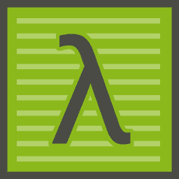
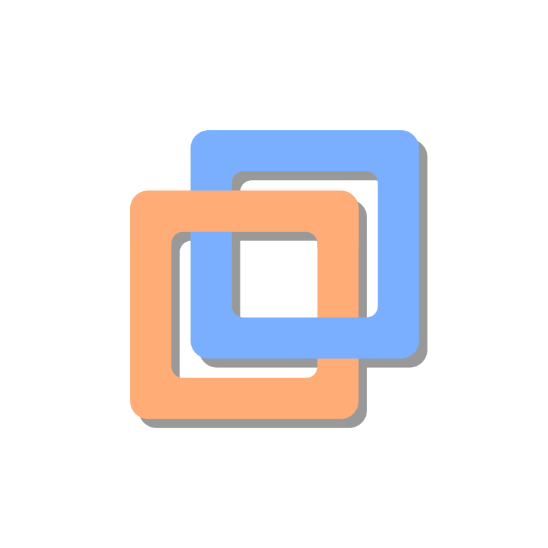
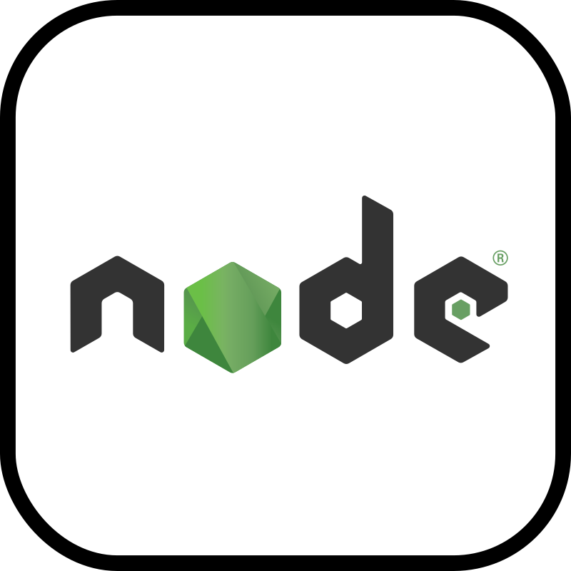
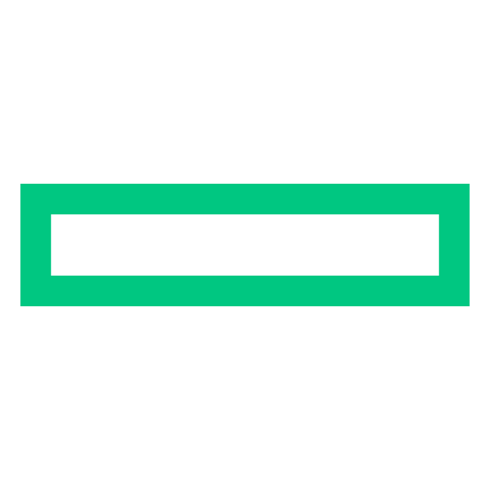

# Hi, I'm Milan Shrestha 👋

## Technology Professional | Product Builder | Systems Thinker

I am a self-taught technology professional from Nepal who enjoys building software that solves practical, everyday problems.

My interests extend beyond writing code. I enjoy understanding how people interact with technology, identifying inefficiencies, and designing products that make work and life simpler.

Currently, I'm building **Khaancho**, a classified advertising platform focused on creating a better local marketplace experience while continuously exploring AI-assisted software development and modern web technologies.

---

## 🚀 What I'm Working On

- 🛠 Building **Khaancho** — A next-generation classified advertising platform.
- 💻 Developing full-stack web applications.
- 🤖 Exploring AI-assisted software development.
- 📚 Creating knowledge management systems and technical documentation.
- ⚙️ Improving business processes through technology.

---

## 💡 Philosophy

> Technology should solve real problems, not create unnecessary complexity.

I believe software should be:

- Useful
- Simple
- Maintainable
- Human-centered
- Built for long-term value

---

## 🧠 Skills

### Software Development

- Full Stack Web Development
- REST APIs
- Database Design
- System Architecture
- Software Debugging

### Product

- Product Strategy
- MVP Planning
- Systems Thinking
- Business Analysis
- UX-Oriented Problem Solving

### AI

- Prompt Engineering
- AI-Assisted Development
- Workflow Automation
- Knowledge Base Development

### Professional

- Technical Documentation
- Project Planning
- Process Improvement
- Critical Thinking
- Continuous Learning

---

## 💼 Experience

### IT Officer
*Current*

- IT Operations
- Technical Support
- Knowledge Base Management
- Process Automation
- System Administration

### Front Office Receptionist
**Hotel Nature**

- Guest Relations
- Reservation Management
- Customer Service
- Cross-department Coordination

### Cable TV System Technician
**Nexus Pvt. Ltd.**

- Satellite TV Installation
- CATV / SMATV Systems
- RF Signal Troubleshooting
- Technical Field Support

---

## 🌱 Current Learning

- Software Architecture
- Scalable System Design
- AI Engineering
- Product Management
- Cloud Technologies

---

## 📌 Featured Projects

### Khaancho
A modern classified advertising platform designed to simplify buying, selling, and local discovery.

**Focus Areas**

- Product Design
- Marketplace Systems
- User Experience
- AI Integration
- Scalable Architecture

---

### Kamana Code

Building software with a philosophy:

> Think. Code. Build.

---

## 📈 Goals

- Build products that positively impact millions of people.
- Create scalable technology businesses.
- Contribute to open-source projects.
- Continue learning every day.

---

## 📫 Connect

- GitHub: https://github.com/milanshrestha

---

> *"Build technology that people genuinely need."*

---

> Tools, languages, and other things that I use!

<table>
  <tr>
    <td align="center" width="96">
      
       Thinkpad
    </td>
    <td align="center" width="96">
      
       VSCode
    </td>
    <td align="center" width="96">
      
       11ty
    </td>
    <td align="center" width="96">
      
       Cmder
    </td>
    <td align="center" width="96">
      
       Web.Dev
    </td>
    <td align="center" width="96">
      
       VMware
    </td>
    <td align="center" width="96">
      
       Mikrotik
    </td>
    <td align="center" width="96">
      
       Cisco
    </td>
    <td align="center" width="96">
      
       Fortinet
    </td>
  </tr>
  <tr>
    <td align="center" width="96"> 
      
       Ubuntu
    </td>
    <td align="center" width="96">
      
       Debian
    </td>
    <td align="center"  width="96">
      
       OpenBSD
    </td>
    <td align="center"  width="96">
      
       Laragon
    </td>
    <td align="center" width="96">
      
       MongoDB
    </td>
    <td align="center"  width="96">
      
       Angular
    </td>
    <td align="center" width="96">
      
       ExpressJS
    </td>
    <td align="center" width="96">
      
       NodeJS
    </td>
    <td align="center" width="96">
      
       Dev.Google
    </td>
    <td align="center" width="96">
      
       HPE
    </td>
  </tr>
</table>
